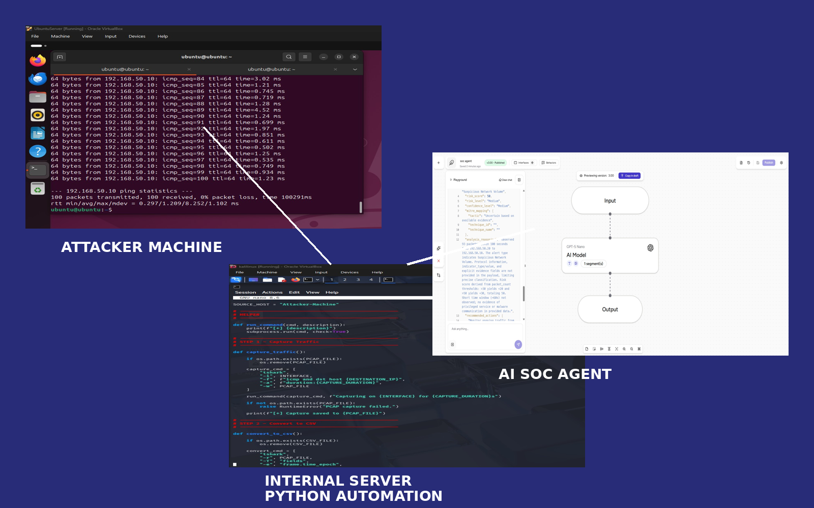

# AI-SOC-ANALYST-HOME-LAB
AI-powered SOC Analyst home lab using Python, packet capture, and an AI triage agent.

An automated cybersecurity detection lab that combines **Python network monitoring**, **packet analysis**, and an **AI-powered SOC analyst agent** for threat triage.

This project demonstrates how security alerts can be automatically analyzed using an AI agent following a SOC playbook.


# Architecture



The lab simulates a small enterprise network where an attacker generates suspicious traffic and an AI SOC agent automatically analyzes alerts.

---

# Lab Components

### 1. Attacker Machine
Kali Linux generates malicious traffic (ICMP flood simulation using ping).

### 2. Internal Server
Ubuntu server running a Python automation script that:

• Captures network traffic using tshark  
• Converts PCAP to CSV  
• Detects suspicious IPs based on packet threshold  
• Generates alert JSON  
• Sends alert to AI SOC agent API

### 3. AI SOC Analyst Agent
An AI agent analyzes the alert using a structured SOC playbook and produces:

• Threat classification  
• Risk score  
• MITRE ATT&CK mapping  
• Recommended analyst actions  

---

# Detection Workflow

1️⃣ Attacker generates traffic

2️⃣ Internal server captures packets using `tshark`

3️⃣ Python script analyzes packet volume

4️⃣ Suspicious IPs detected

5️⃣ Alert JSON generated

6️⃣ Alert sent to AI SOC agent

7️⃣ AI agent performs automated triage

---

# Example Alert JSON

```json
{
  "alert_id": "SOC-123ABCD",
  "alert_type": "Suspicious Network Volume",
  "indicator_type": "ip",
  "indicator_value": "192.168.50.10",
  "destination_host": "Internal-server",
  "destination_ip": "192.168.50.20",
  "evidence": {
    "packet_count": 93,
    "time_window_seconds": 100
  }
}
```

---

# Technologies Used

Python  
Wireshark / Tshark  
VirtualBox  
Ubuntu Server  
Kali Linux  
AI SOC Agent (Airia)

---

# Screenshots

## Attacker Machine


## Internal Server Detection


## AI SOC Agent Analysis


---

# SOC Playbook

The AI agent follows a structured SOC triage playbook:

• Input validation  
• Threat classification  
• Risk scoring  
• MITRE ATT&CK mapping  
• Recommended actions  
• Executive summary

---

# Future Improvements

Add Suricata IDS integration  
Add SIEM pipeline  
Add automated blocking (iptables)  
Add threat intelligence enrichment  

---

# Author

Cybersecurity Lab Project  
SOC Analyst Automation
